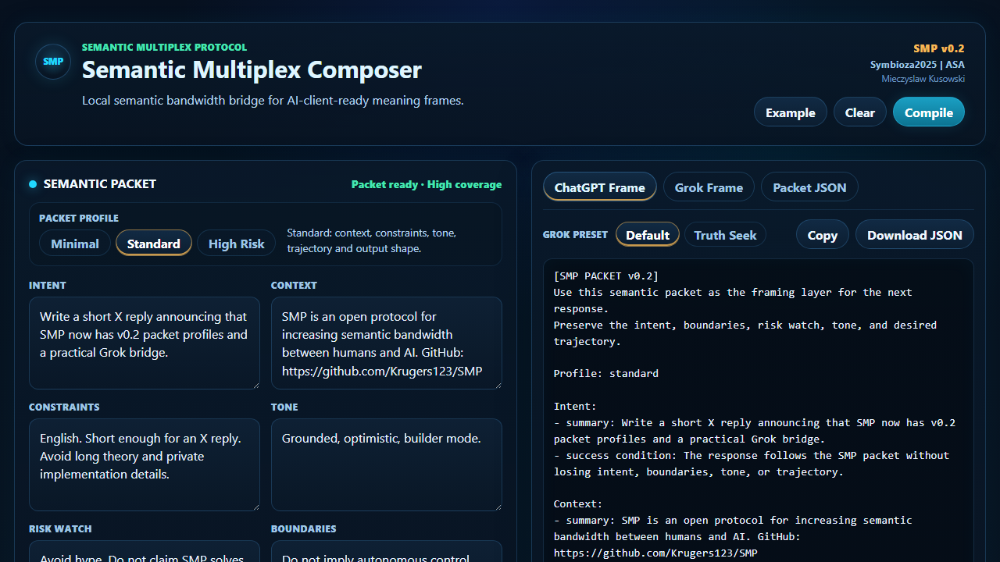

# SMP - Semantic Multiplex Protocol

SMP is an open-source protocol for increasing the bandwidth of meaning between humans and AI systems.

Tagline: **Meaning Bandwidth for AI.**

It was born from a simple frustration: modern AI systems can reason, build, write, analyze, and assist with complex work, but the interface between human thought and AI understanding is still narrow, linear, and slow.

Human-AI interaction is still often compressed into a narrow, mostly linear text channel:

- one message,
- one response,
- one correction,
- one clarification.

But human intent rarely arrives as a single line of text. It often carries context, uncertainty, emotion, boundaries, risk, desired tone, memory, and a preferred trajectory at the same time.

SMP explores a structured way to transmit those layers as semantic packets: compact, inspectable frames of meaning that can move faster than ordinary prompt-and-correction loops.

## Core Idea

SMP is not just better prompting and not just longer context.

The core problem is semantic bandwidth. Human thought can contain a structure, image, direction, emotional pressure, uncertainty, and boundary conditions all at once. Today, that multidimensional meaning is usually compressed into plain sentences, typed through a keyboard, then reconstructed by the AI through repeated clarification.

SMP treats that loss as an interface problem.

It is a protocol for carrying multiple channels of meaning in a clear, inspectable, and human-centered format:

- what the human wants,
- why it matters,
- what must not be lost,
- what tone is needed,
- what risks should be watched,
- what boundaries must remain active,
- what trajectory the interaction should preserve,
- what shape the output should take.

The long-term direction is a non-invasive cognitive interface layer: not only text, not only speech, but a higher-density way to pass structured meaning into AI systems.

## Public Formula

```text
ASA observes.
ASC stabilizes.
SMP increases semantic bandwidth.
Human authority remains explicit.
```

## Project Status

SMP is currently in `v0.2 draft` design stage.

This repository contains public-safe protocol documents, draft packet models, and neutral examples. It does not contain private scoring systems, hidden control logic, deployment details, or sensitive evaluation data.

## First Working Bridge

SMP now includes a minimal ChatGPT bridge:

```powershell
python tools/validate_packet.py examples/chatgpt_bridge_packet.json
python tools/compile_packet.py examples/chatgpt_bridge_packet.json
python tools/compile_packet.py examples/grok_bridge_packet.json --target grok
python tools/compile_packet.py examples/grok_bridge_packet.json --target grok --grok-preset truth_seek
```

The bridge validates an SMP packet and compiles it into an AI-client-ready semantic frame.

See [docs/CHATGPT_BRIDGE.md](docs/CHATGPT_BRIDGE.md).
See [docs/GROK_BRIDGE.md](docs/GROK_BRIDGE.md).

## Why It Helps

SMP is meant to reduce prompt friction.

Instead of sending a flat prompt and correcting the AI repeatedly, the user can transmit intent, context, constraints, tone, risks, boundaries, trajectory, and desired output shape before the response begins.

See [docs/BEFORE_AFTER.md](docs/BEFORE_AFTER.md).
See [docs/PACKET_PROFILES.md](docs/PACKET_PROFILES.md).

## Local Web Composer

SMP also includes a small local web composer:



```powershell
.\start_smp_web.ps1
```

Then open:

```text
http://localhost:8787
```

The composer lets you fill SMP channels in a browser, generate packet JSON, and copy ChatGPT-ready or Grok-ready frames.

The v0.2 composer adds packet profiles, a semantic coverage estimate, and a Grok truth-seeking preset.

See [docs/WEB_COMPOSER.md](docs/WEB_COMPOSER.md).

## What SMP Is

- A protocol for structured human intent transmission.
- A semantic packet model for human-AI interaction.
- A compact frame for cognitive compression: intent, context, risk, tone, boundaries, and output shape in one inspectable object.
- A public interface layer that can be used by agents, assistants, IDEs, dashboards, and decision-support tools.
- A way to reduce semantic loss between what a human means and what an AI system receives.

## What SMP Is Not

- SMP is not an AI model.
- SMP does not modify model weights.
- SMP is not an autonomous control system.
- SMP does not replace human authority.
- SMP is not a guarantee of alignment, truth, or safety.
- SMP is not a hidden backend or proprietary prompt wrapper.
- SMP is not meant to make human expression mechanical or bureaucratic.

## Repository Map

```text
.
|-- README.md
|-- ORIGIN.md
|-- SPEC.md
|-- PUBLIC_SCOPE.md
|-- SMP_ARCHITECTURE.md
|-- SMP_BOUNDARIES.md
|-- SMP_PACKET_MODEL.md
|-- SMP_EXAMPLES.md
|-- GOVERNANCE.md
|-- DISCLAIMER.md
|-- LICENSE
|-- schemas/
|   |-- smp_packet.v0.json
|   `-- smp_packet.v0.2.json
|-- tools/
|   |-- validate_packet.py
|   `-- compile_packet.py
|-- docs/
|   |-- CHATGPT_BRIDGE.md
|   |-- GROK_BRIDGE.md
|   |-- BEFORE_AFTER.md
|   |-- PACKET_PROFILES.md
|   `-- WEB_COMPOSER.md
|-- web/
|   |-- index.html
|   |-- styles.css
|   `-- app.js
|-- start_smp_web.ps1
`-- examples/
    |-- minimal_packet.json
    |-- chatgpt_bridge_packet.json
    |-- grok_bridge_packet.json
    |-- standard_profile_packet.json
    |-- high_risk_profile_packet.json
    |-- coding_task_packet.json
    |-- creative_direction_packet.json
    `-- high_risk_decision_packet.json
```

## License

SMP is released under the Apache License 2.0.
